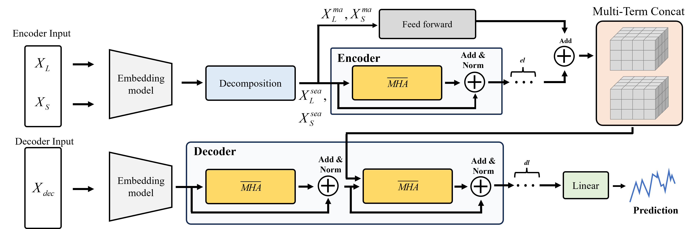
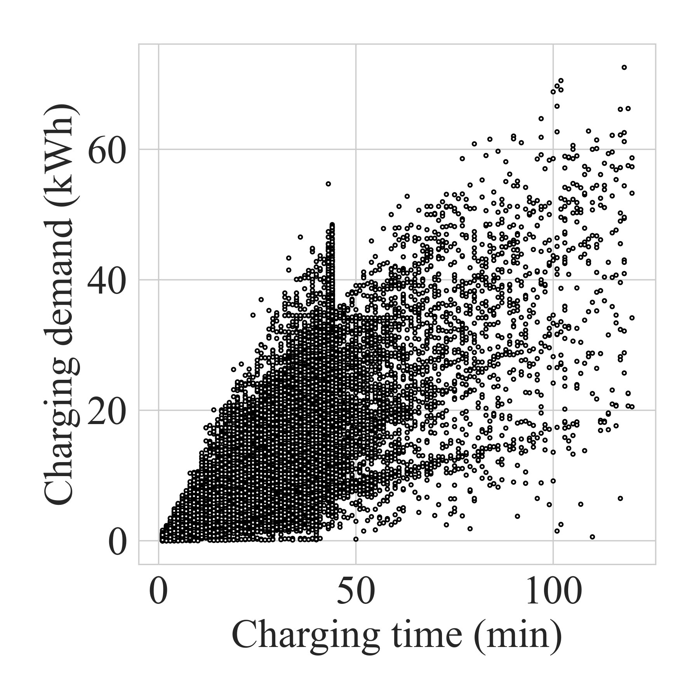
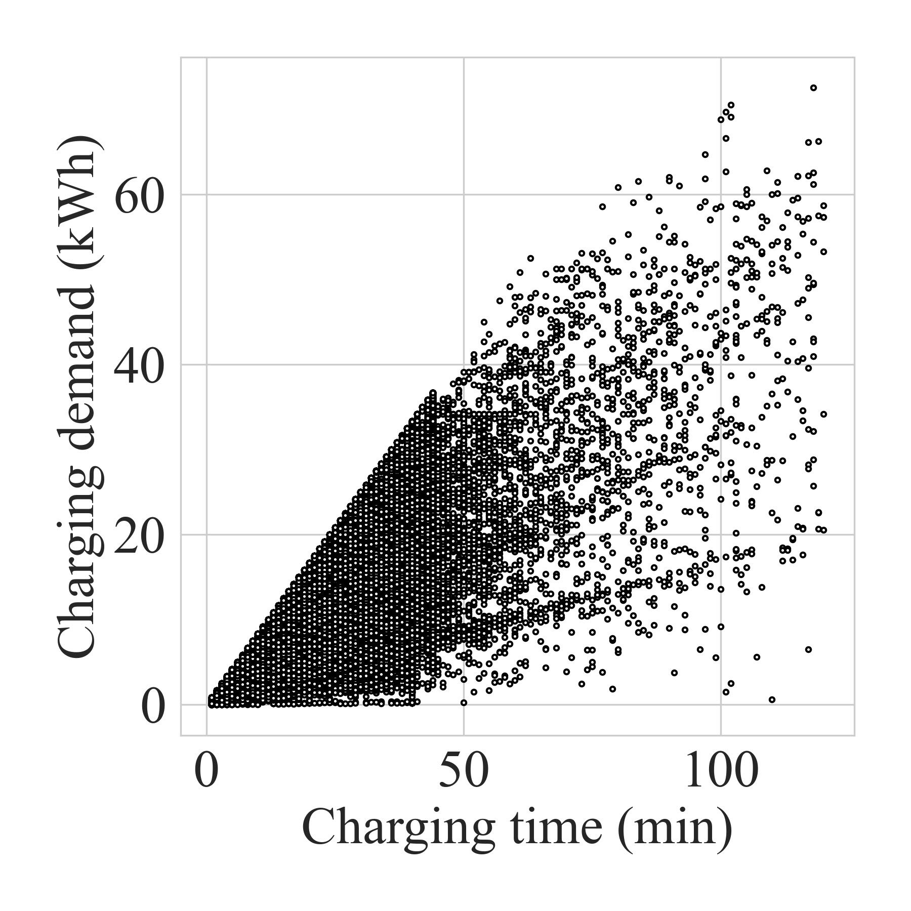

# DeFusionformer (Under Review at IEEE Transactions on Industrial Informatics)

---

This is the official implementation of DeFusionformer, a novel transformer-based architecture for the tasks of decomposition and multi-term fusion in industrial applications. The model is designed to effectively integrate and process data from multiple terms, enhancing forecasting performance in the presence of non-stationarity.

🚩News(March 2025): The authors provide DeFusionformer model (Paper title : DeFusionformer to Predict EV Charging Demand at an Individual Fast-Charging Station) 

# Requirements

---

- Python 3.8.18
- numpy == 1.24.3
- pandas == 2.0.3
- scikit-learn == 1.3.2
- scipy == 1.10.1
- scipy-optimize == 0.10.2
- torch == 2.4.0 + cu121

```c
pip install -r requirements.txt
```

# DeFusionFormer Architecture

---

We developed DeFusionformer, which employs a Transformer architecture, for day-ahead forecasting of charging demand at individual EV fast-charging stations. DeFusionformer adopts leverage decomposition to separate seasonal and moving average components, allowing it to learn patterns for each time-series element effectively. By utilizing multi-term inputs that include both long-term and short-term information, the proposed model is able to learn non-stationarity.

<div style="display: flex; justify-content: center; align-items: center;">
  <div style="text-align: center;">
    
    <p><b>Figure 1.</b> architecture_DeFusionformer.</p>
  </div>
</div>


# Data

---

# Table I: Data Summary from Each Individual Fast-Charging Station

The charging datasets are collected from six real-world fast-charging stations in Jeju Island, South Korea, spanning the period from January 1, 2021, to June 22, 2022. All fast-charging stations are equipped with 50 kW CHAdeMO fast chargers, including stations 1, 2, 3, 4, 5, and 6, which have 4, 3, 2, 3, 2, and 3 chargers, respectively. 
Table I shows the characteristics of each charging station. During the data collection period, the number of charging sessions at each station ranged from 6,821 to 29,050. Stations 1 and 2 are located in areas with high foot traffic, resulting in higher operation rates, average charging amounts, and charging sessions compared to other stations. 

| **Operational Environment** | **Station** | **Operation Rate** | **Average Charging Amount per Day (kWh)** | **Average Number of Charges per Day** | **Number of Charging Sessions** |
|-----------------------------|-------------|---------------------|-------------------------------------------|---------------------------------------|----------------------------------|
| Public Facility            | 1           | 79.80%             | 722.67                                    | 53.99                                 | 29,050                           |
| Public Facility            | 2           | 75.22%             | 612.63                                    | 46.31                                 | 24,917                           |
| Public Facility            | 3           | 63.36%             | 308.45                                    | 23.75                                 | 12,782                           |
| Airport                    | 4           | 57.64%             | 317.25                                    | 22.23                                 | 11,636                           |
| Public Parking Lots        | 5           | 64.03%             | 293.33                                    | 20.37                                 | 6,821                            |
| Public Parking Lots        | 6           | 66.26%             | 367.61                                    | 20.92                                 | 11,888                           |

# Preprocessing

---

The data used in this study consists of charging records from fast chargers. These raw records provide detailed information about each charging event, including key attributes such as the charging start time, end time, and total energy consumed (kWh). To prepare the data for analysis, preprocessing is performed by considering both the charging time and energy consumption. Specifically, charging events are classified as outliers if the recorded energy consumption exceeds the theoretical maximum, which is calculated as the product of the charger’s rated capacity (50kW) and the charging time. The charging amounts classified as outliers are replaced with theoretically calculated charging energy. Fig. 4 depicts the impact of preprocessing on the dataset before and after preprocessing the outliers. 
Once the dataset is cleaned, all charging event records are transformed into a time-series format. This transformation involved evenly distributing the charging power consumption across the corresponding time intervals. For instance, if a single charging event spans multiple time intervals, the total energy consumed during the event was proportionally allocated to each interval. As a result, time-series data of charging power consumption (kW) was generated on an hourly basis.

<div style="display: flex; justify-content: center; align-items: center;">
  <div style="text-align: center; margin-right: 20px;">
    
    <p><b>Figure 2.</b> before_preprocessing.</p>
  </div>
  <div style="text-align: center;">
    
    <p><b>Figure 3.</b> after_preprocessing.</p>
  </div>
</div>

# DeFusionformer Performance

---

## Compared benchmarks
 - Performance of Each Individual Fast-Charging Station

| Station | Model         | MAE (KW)        | MSE (kW²)        | uRMSE (%)       |
|---------|---------------|-----------------|------------------|-----------------|
| 1       | SVR           | 19.84           | 617.75           | 15.25           |
|         | LSTM          | 18.82 ± 0.14    | 522.99 ± 5.82    | 14.46 ± 0.11    |
|         | Transformer   | 18.35 ± 1.07    | 520.09 ± 38.38   | 14.11 ± 0.82    |
|         | Reformer      | 17.27 ± 0.44    | 477.09 ± 9.35    | 13.28 ± 0.35    |
|         | Autoformer    | 20.60 ± 1.03    | 668.48 ± 77.32   | 15.83 ± 0.79    |
|         | Informer      | 15.28 ± 0.33    | 404.84 ± 11.48   | 11.66 ± 0.19    |
|         | DeFusionformer| 14.90 ± 0.23    | 391.58 ± 7.57    | 11.45 ± 6.18    |
| 2       | SVR           | 19.00           | 551.99           | 17.96           |
|         | LSTM          | 17.27 ± 0.19    | 411.60 ± 6.49    | 16.32 ± 0.17    |
|         | Transformer   | 17.38 ± 1.21    | 454.82 ± 35.77   | 16.42 ± 1.14    |
|         | Reformer      | 15.91 ± 0.16    | 411.25 ± 4.63    | 15.04 ± 0.16    |
|         | Autoformer    | 18.14 ± 1.72    | 533.21 ± 103.73  | 17.15 ± 1.63    |
|         | Informer      | 13.13 ± 0.28    | 316.18 ± 9.81    | 12.41 ± 0.27    |
|         | DeFusionformer| 12.59 ± 0.25    | 293.68 ± 7.72    | 11.90 ± 0.23    |
| 3       | SVR           | 9.99            | 148.04           | 16.91           |
|         | LSTM          | 9.76 ± 0.19     | 134.35 ± 1.30    | 16.54 ± 0.14    |
|         | Transformer   | 9.01 ± 0.45     | 134.09 ± 6.91    | 16.36 ± 0.76    |
|         | Reformer      | 9.46 ± 0.21     | 129.38 ± 2.23    | 15.56 ± 0.36    |
|         | Autoformer    | 10.96 ± 0.67    | 183.76 ± 23.35   | 18.03 ± 1.28    |
|         | Informer      | 8.02 ± 0.08     | 111.44 ± 0.95    | 13.49 ± 0.14    |
|         | DeFusionformer| 7.97 ± 0.10     | 111.09 ± 1.46    | 13.52 ± 0.17    |
| 4       | SVR           | 13.76           | 353.34           | 12.88           |
|         | LSTM          | 13.24 ± 0.11    | 305.21 ± 2.27    | 12.40 ± 0.10    |
|         | Transformer   | 13.64 ± 0.44    | 316.07 ± 13.03   | 12.77 ± 0.41    |
|         | Reformer      | 12.89 ± 0.15    | 301.68 ± 15.89   | 12.08 ± 0.15    |
|         | Autoformer    | 13.71 ± 0.90    | 316.87 ± 30.35   | 12.84 ± 0.85    |
|         | Informer      | 10.97 ± 0.12    | 244.66 ± 4.05    | 10.24 ± 0.11    |
|         | DeFusionformer| 10.64 ± 0.29    | 236.67 ± 3.47    | 9.96 ± 0.28     |
| 5       | SVR           | 11.06           | 190.89           | 15.21           |
|         | LSTM          | 11.05 ± 0.05    | 183.06 ± 1.16    | 15.19 ± 0.07    |
|         | Transformer   | 10.99 ± 0.32    | 182.21 ± 6.33    | 15.18 ± 0.26    |
|         | Reformer      | 10.49 ± 0.15    | 171.74 ± 1.63    | 14.43 ± 0.08    |
|         | Autoformer    | 10.69 ± 0.90    | 189.36 ± 17.15   | 14.69 ± 0.84    |
|         | Informer      | 9.42 ± 0.12     | 154.10 ± 2.49    | 12.94 ± 0.20    |
|         | DeFusionformer| 9.25 ± 0.29     | 150.47 ± 0.69    | 12.62 ± 0.28    |
| 6       | SVR           | 11.16           | 199.31           | 13.42           |
|         | LSTM          | 12.68 ± 0.09    | 220.77 ± 1.76    | 15.25 ± 0.12    |
|         | Transformer   | 12.02 ± 0.22    | 204.89 ± 3.72    | 14.46 ± 0.27    |
|         | Reformer      | 11.97 ± 0.06    | 203.91 ± 0.52    | 14.40 ± 0.09    |
|         | Autoformer    | 13.37 ± 0.71    | 294.66 ± 25.55   | 16.69 ± 0.86    |
|         | Informer      | 11.26 ± 0.08    | 198.41 ± 2.02    | 13.63 ± 0.34    |
|         | DeFusionformer| 10.79 ± 0.16    | 185.15 ± 1.29    | 12.97 ± 0.20    |

 - Total Performance

| Model          | MAE (KW)        | MSE (kW²)        | uRMSE (%)       |
|----------------|-----------------|------------------|-----------------|
| SVR            | 56.49           | 4362.68          | 16.18           |
| LSTM           | 50.43 ± 0.75    | 3571.14 ± 98.84  | 14.45 ± 0.22    |
| Transformer    | 52.02 ± 1.53    | 3780.67 ± 182.35 | 14.18 ± 0.44    |
| Reformer       | 44.23 ± 0.77    | 2967.05 ± 75.01  | 14.27 ± 0.22    |
| Autoformer     | 51.33 ± 6.30    | 3703.30 ± 526.51 | 13.71 ± 1.01    |
| Informer       | 31.58 ± 0.39    | 1751.63 ± 36.38  | 9.05 ± 0.11     |
| DeFusionformer | 30.03 ± 0.51    | 1588.72 ± 48.32  | 8.58 ± 0.19     |

 - Generalization Performance
<div style="display: flex; justify-content: center; align-items: center;">
  <div style="text-align: center; margin-right: 20px;">
    
    <p><b>Figure 4.</b> Comparison of training and validation loss per epoch to observe overfitting with 5 different fixed random seed.</p>
  </div>
  <div style="text-align: center;">
    
    <p><b>Figure 5.</b> The average of derivative in validation loss for each station..</p>
  </div>
</div>

 - Multi-term Testing

<div style="display: flex; justify-content: center; align-items: center;">
  <div style="text-align: center;">
    
    <p><b>Figure 6.</b> Multi-term Scenario.</p>
  </div>
</div>

 - Decompostion performance
<div style="display: flex; justify-content: center; align-items: center;">
  <div style="text-align: center;">
    
    <p><b>Figure 7.</b> Decompostion performance.</p>
  </div>
</div>

